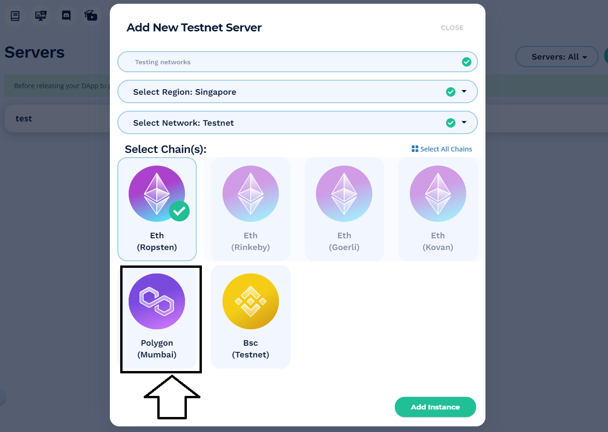

# Table of Content

- [Table of Content](#table-of-content)
  - [1. Metamask wallet install and configurations](#1-metamask-wallet-install-and-configurations)
  - [2. Install VSCode](#2-install-vscode)
  - [3. Create a account in Moralis and Mortalis server](#3-create-a-account-in-moralis-and-mortalis-server)
  - [4. Access Remix online solidity IDE](#4-access-remix-online-solidity-ide)
  - [5. Install Git](#5-install-git)
  - [6. Install nodejs](#6-install-nodejs)

Prerequistes necessary for the "What is NFT" session

Below instructions works well 

## 1. Metamask wallet install and configurations

Install Metamask from the Metamask [download](https://metamask.io/download/) page on your browser

***Steps to configure the Metamsk wallet***

- [x] Follow the steps to create a wallet. Make sure to save the seed phrase in some place safe.
- [x] Type the phrase in the next page when asked for and click on confirm.
- [x] You have now successfully created your metamask wallet.

***Metamask wallet account configuration***

Notice that the wallet is by Default connected to the Ethereum network. In order to connect your wallet to the Mumbai Testnet, you need to configure the wallet using the following steps.

- [x] Select “Settings” from the drop down menu on the top right corner of your Metamask wallet.

- [x] Select “Networks” from the menu to the left.

- [x] Connect your wallet to the Mumbai Testnet using the following parameters.

> **Mumbai Testnet** \
Network Name: Polygon Testnet \
New RPC URL: <https://matic-mumbai.chainstacklabs.com> \
ChainID: 80001 \
Symbol: matic \
Block Explorer URL: <https://mumbai-explorer.matic.today/> \

- [x] Once you save the network, you will notice the addition of Polygon testnet to the network list.  
- [x] Add testnet matic coins to the wallet

>Access the website: <https://faucet.polygon.technology/> \
Select below parameters \
>> Network: Mumbai \
>> Select Token: MATIC Token \
>> Wallet address: Put your "Polygon Testnet wallet Adress" \
>> Click on "Submit"

>> This step will transfer anything between 0.5 to 1 Matic token to the wallet and sometime takes time based on the network and how many transactions are being executed.
>> You can add more test token as necessary. For the session we need less than 0.5 MATIC test tokens.

## 2. Install VSCode

Download and Install VSCode from [VSCode Download page](https://code.visualstudio.com/download)

## 3. Create a account in Moralis and Mortalis server

- [x] Signup for a free account [here](https://moralis.io/)
- [x] Create a moralis new server select "Testnet Server"

- [x] A pop-up window asking for server info will appear next. Enter the below server details

>Select region: Singapore \
>Select Network: Testnet \
>Select Chain(s): Polygon(Mumbai)

- [x] click “Add Instance”. It may take some time for the server to spin up, so please be patient.  

## 4. Access Remix online solidity IDE

- [x] Access the [Remix.ethereum.org](https://remix.ethereum.org/)
- [x] Accept all the default

## 5. Install Git

- [x] Install Git using the instructions provided [here](https://git-scm.com/book/en/v2/Getting-Started-Installing-Git)

## 6. Install nodejs

- [x] Install nodejs using the [link](https://nodejs.org/en/download/)
- [x] Follow through all the on screen instructions.
- [x] Test if nodejs is installed properly.
  - [x] open powershell or command prompt and run below commands
  - [x] node --version
  - [x] npm --version
   