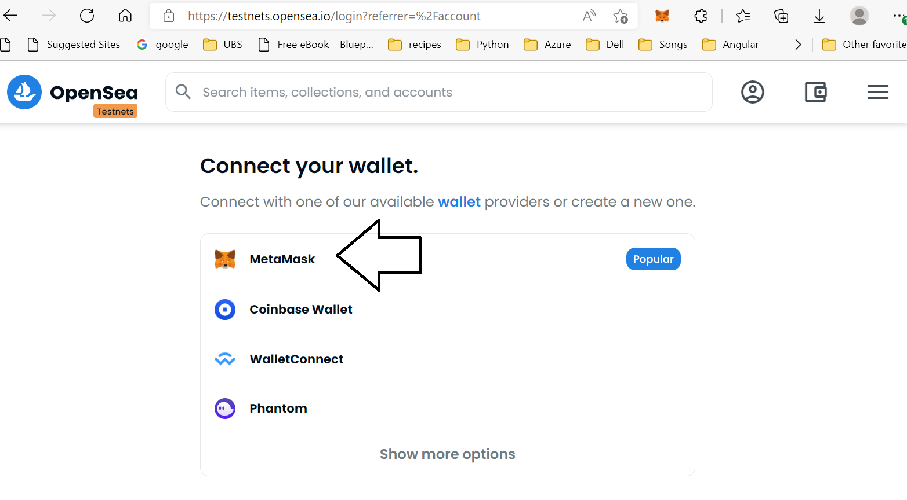
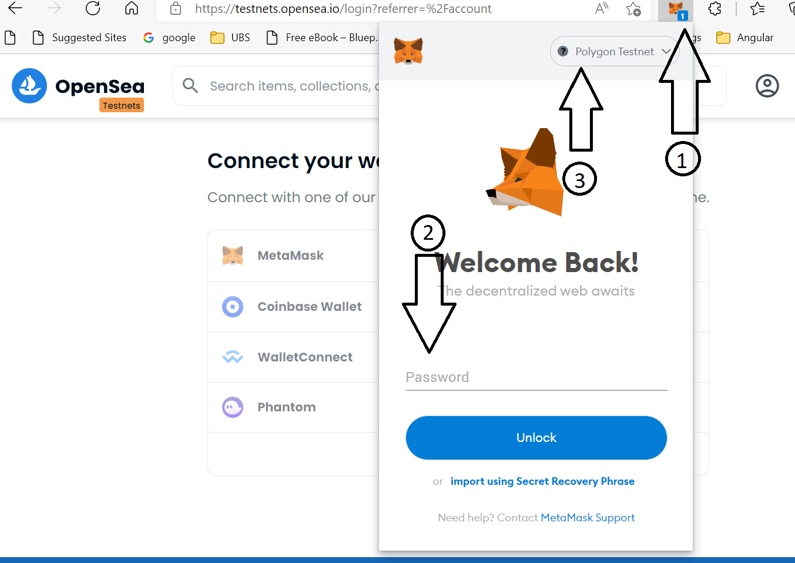
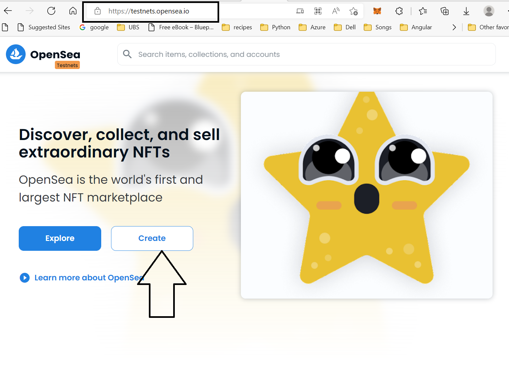
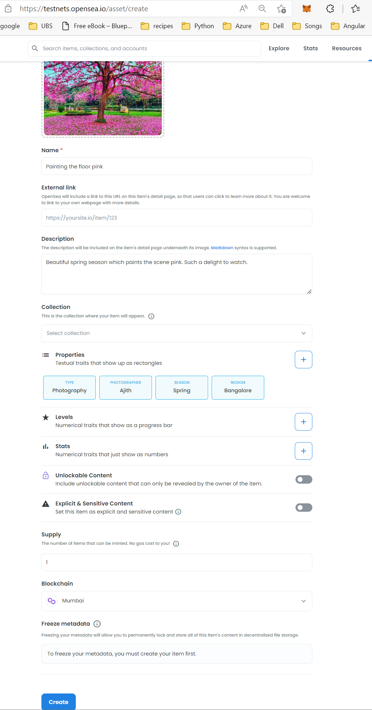
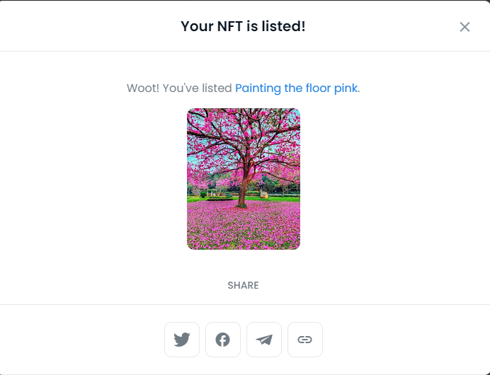

# Table of Content

- [Table of Content](#table-of-content)
  - [Pre-requisites](#pre-requisites)
  - [Connect wallet to testnet opensea](#connect-wallet-to-testnet-opensea)
  - [Mint one NFT in opensea](#mint-one-nft-in-opensea)
    - [Mint one NFT](#mint-one-nft)
    - [List your digital art for sale](#list-your-digital-art-for-sale)
  - [Mint 10 Digital art collection.](#mint-10-digital-art-collection)
    - [Preparation](#preparation)
    - [Generate digital art and upload to IPFS](#generate-digital-art-and-upload-to-ipfs)
    - [Deploy the NFT smart contract (ERC-1155)](#deploy-the-nft-smart-contract-erc-1155)
    - [List NFT collection in testnet opensea](#list-nft-collection-in-testnet-opensea)

## Pre-requisites

Please follow the steps provided in [Prerequisites](Prerequisites.md) to setup the necessary softwares for the session.

This session will be done on the **testnet** - so we do not need actual crypto currencies. A way to get testnet polygon network MATIC token is explained in the [Create metamask wallet section](/Prerequisites.md#1-metamask-wallet-install-and-configurations)

## Connect wallet to testnet opensea
- Open https://testnets.opensea.io/
- Select Metamask, under "Connect your wallet"
 
- Connect to your metamask wallet as shown in the below screenshot 
  
  - Click on the metamaks wallet 
  - Metamask extension will request your password if not logged in already 
  - Select "Polygon Testnet" or "Mumbai Testnet" (name that you created in the ["Add Networks" section](Prerequisites.md#1-metamask-wallet-install-and-configurations) ) in the "Networks" drop down.
- This will open up opensea testnet home page.
  
## Mint one NFT in opensea

For the purpose of this session, lets mint a beautiful spring image attached under assets folder [spring_bangalore.jpg](assets/spring_bangalore.jpg). But feel free to pick digital art, picture or digital content of your choice.

    

### Mint one NFT
- Click on "Create". Below screenshot is how it looks like at the time of writing this, but layout may change.
  
    - You will get a prompt to Sign as shown below. Click on "Sign"
    
    - This will open up "Create new Item" page as shown below.
    
    - Fill in all the details as you see on the screen
      - upload the digital art/content of your choice under "Image, Video, Audio, or 3D Model*". In this case [spring_bangalore.jpg](assets/spring_bangalore.jpg)
      - give it a "Name"
      - Optional: Prvovide a "External link" if you have any which describes the art. 
      - Provide a "Description"
      - Select a "Collection" from drop down if you alredy have collection. Leave it blank if this is your frist ever NFT
      - Click on the "+" sign next to the "Properties" and add properties about the digital art. These are properties which defines why your art is non fungible. More information in the session. 
      - You can ignore Levels, Stats, Unlockable Content, "Explicit & sensitive Content" for hte purpose of this session. But they are slef explanatory. 
      - Update "Supply". This gives you option to mint one or more of your NFT.
      - Select "Blockchain", In this case "Mumbai".
      - Click on "Create"
      - Do the Captcha (if you get one).
      - This will mint NFT in the Mumbai testnet blockchain.
        
    - You have now successfully minted one NFT. You should see a screen like this
    

### List your digital art for sale
  - Click on "Sell" as shown in the previous image
  - Fill in the Price you want to sell this for. Example screenshot below 
    
  - Click on "Complete Listing"
  - Sign the message
    
  - You should see a "Your NFT is listed" message.
    

## Mint 10 Digital art collection.

In this section lets look at minting 10 digital art that is created from layers.

Below diagram depicts the steps we want to cover


We will be doing below steps in our next session below.

1. Generate digital art colelction using layers <br>
   - In this step we will run a nodejs([index.js](/index.js)) script which will create unique set of art based on the layers that we placed in the [input](/input/) folder.
   - The resultant art as well as the metadata file will be placed in the [output](/output/) folder.
2. Upload ART to Moralis web3 developement server <br>
   - Moralis is a web3 development envirponment. In this step we upload the generted digital art to the Moralis IPFS.
3. Upload the metadata (properties) using the ID generated in the previous step.
4. Compile and deply a smart contract to Mint these NFT collection 
5. View and sell your NFT art on Opensea

### Preparation 
- Open Gitbash and clone the project https://github.com/ajithkotian/nft.git to your local machine. 
- Command: `git clone https://github.com/ajithkotian/nft.git`

- Open the project in VSCode. File --> Open Folder --> Choose the folder in which git checkout was done.
- Using the VSCode editor, Update the Moralis server details in [index.js](index.js) line 32 onwards. Moralis Server creation steps are provided in prerequisites steps [here](/Prerequisites.md#3-create-a-account-in-moralis-and-mortalis-server)
```
  const serverUrl = "<INSERT_MORALIS_SERVER_URL>";
  const appId = "<INSERT_MORALIS_APP_ID>";
  const masterKey = "<INSERT_MORALIS_MASTER_KEY>";
  const apiUrl = "https://deep-index.moralis.io/api/v2/ipfs/uploadFolder";
  // xAPIKey available here: https://admin.moralis.io/web3Api
  const apiKey = "<INSERT_API_KEY>";
```
   - Fill these details from the Moralis server which was created as part of the pre-requisites [steps here](/Prerequisites.md#3-create-a-account-in-moralis-and-mortalis-server)

  - Go to https://admin.moralis.io/servers 
  - Details can be found here 
   
    - Copy these details to `{serverUrl, appId,  masterKey}` in the code snippet mentioned above.
    - keep the `{apiUrl}` same 
    - Go to https://admin.moralis.io/web3Api and copy the API key from the drop down and update the `{apiKey}`
    
    - Moralis server url which is added in `{serverUrl}` should also be updated in [config.js](/input/config.js) at line 128 `{baseImageUri}`
  
    ```
    const baseImageUri = "<INSERT_MORALIS_SERVER_URL>";
    ```

  - Install all the node packages required for this projecto to run 
    - Open VSCode
    - Open a "New Terminal" in VSCode using menu Terminal -> New Terminal or shortcut Ctrl + Shift + `
    - Run the command `{npm install}`. This should take about 3-4 mins for it to complete and install upto 530+ packages.
    

### Generate digital art and upload to IPFS

- Run the command `{node .\index.js}`


  - This step will generate 10 digital art based on the layers placed in [input](/input/) folder.
  - Generate metadata file for each art created 
  - It will then upload the files to IPFS via the moralis ipfs gateway
  - Generate the CID and metahash
  - Make note of the IPFS metahash which is displayed in the terminal window output. Example below - you can pick any json file and the metahash remains the same.
  
  ```
   {
    path: 'https://gateway.moralisipfs.com/ipfs/QmcCVRQJkYMr18RWqmHyNTnZockpKgZYdZaLTYUuR3m3sQ/metadata/0000000000000000000000000000000000000000000000000000000000000002.json'
  },
  ```
  In this example QmcCVRQJkYMr18RWqmHyNTnZockpKgZYdZaLTYUuR3m3sQ is the metahash.
  
### Deploy the NFT smart contract (ERC-1155)

- Open https://remix.ethereum.org/ 
- Right click on `Contracts` in the left panel and `New File`
- Give a name with extension .sol Ex: nft_mint.sol
- Copy the content of [nft_mint.sol](/nft_mint.sol) and paste it in the newly created file in remix online tool.
- Replace the <metahash> with the metahash which was generated in the previous step.
  
- **Compile** : By default when the file is saved, the remix IDE will auto compile. You can manually compile this as well by clikcing on "Compile nft_mint.sol" in the below screenshot. 
  
- **Deploy** : Click on `Deploy` button as shown in below screenshot. Select `Injected Web3` under `Environment`. This will open up Metamask wallet permission to connect.
  
  

  Click on `Next` and `Connect` in the metamask wallet.
  This will update the `Account` to metamask wallet account address.
  Click on `Deploy`.
   <br>
  Confirm the gas fee <br>
   <br>
  The contract will be deployed in the Polygon Mumbai testnet blockchain. Copy the contract address by clicking on the copy icon next to newly deployed contract in the left panel.
   <br>
  In this case the Contract address is `0xA653b22321B6771500346E2c1B0aD56852348aBb`


### List NFT collection in testnet opensea

- Go to https://testnets.opensea.io/get-listed/
- Connect your metamsk wallet if it is not already connected [Steps](#connect-wallet-to-testnet-opensea)
- Click on `Live on a Testnet` 
  
- Select `Mumbai` testnet network and paste the `contract address` obtained in the previous step
  
- Submit
- This will now list the NFT collection in testnets opensea
- These can be now listed for sale. 